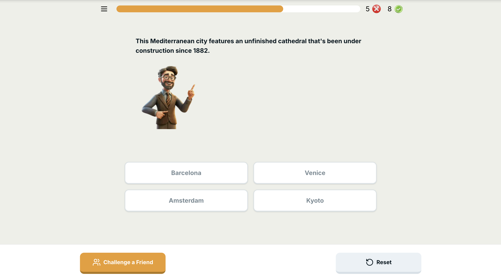
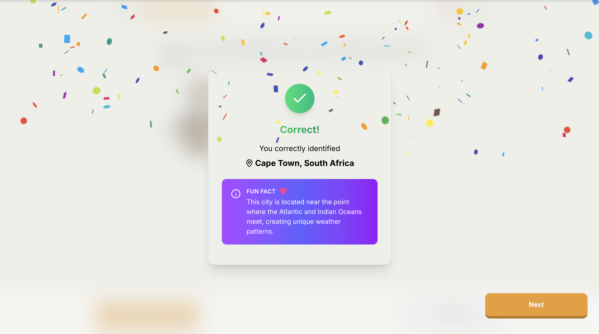
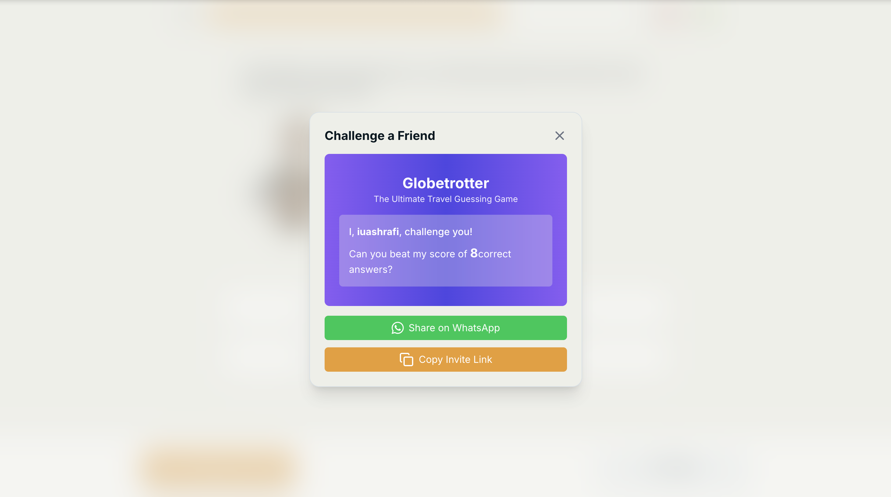

# Globetrotter

Live Link - https://game-globetrotter.vercel.app/

## Project Overview

This **Globetrotter** project consists of:

1. **Frontend**: **Next js** hosted on vercel.
2. **Backend**: Express, Node js hosted on Render, mongoDb for database.

## Installation

#### Prerequisites

- Ensure you have **Node.js** installed (version 18 or higher recommended).

#### Cloning the Repository

- Clone the repository from GitHub:

  ```bash
  git clone https://github.com/iuashrafi/globetrotter.git

  cd globetrotter
  ```

#### Install the packages

- To install the packages run:
  ```bash
  npm install
  ```

#### Env configuration

Add a .env file to root folder 'backend/'

```bash
PORT=8000
MONGO_URI='mongodb://localhost:27017/globetrotter'
NODE_ENV='development'
```

#### Running the Development Server

- Start the development server using the following command:
  ```bash
  npm run dev
  ```

## Screenshots

Please check screenshots folder or directly the github link (incase the screenshots doesn't loads locally)

Game Page


Congratulations


Challenge a Friend

